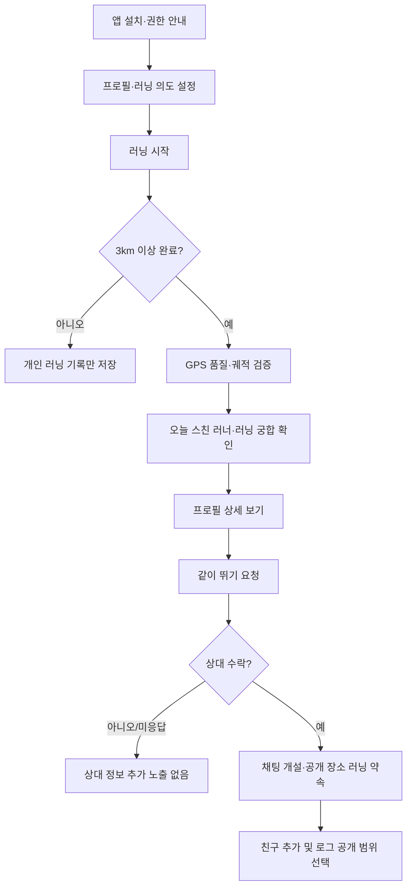

# 같이뛰어 제품 기획서

## 최신 원격 배포 상태 — 2026-09-27

사용자 승인으로 기존 호스티드 dev 프로젝트에 `202608120037`, `202609240001`~`202609240004`를 단일 트랜잭션으로 적용하고 마이그레이션 이력·원문을 함께 기록했다. 씨앗 성장, 매칭 상대 설정, 러닝 소개·약속, 신고 증거 보완이 원격 DB에도 반영됐다. 아래 9월 16일/24일 작업 기록의 ‘원격 미적용’은 당시 상태이며 이 배포로 대체한다.

익명 HTTP 요청 9건의 `42501`, 신고 증거 직접 조회/삽입 권한 차단, 인증 사용자 역할의 본인 조회·타인 GPS 차단을 확인했다. 기존 데이터·개발 테스트 인증 예외·OAuth 설정은 변경하지 않았다. 실제 앱에서 설정 저장·러닝 성장·약속·신고를 수행하는 종단 QA, 정상 가입 계정의 관계별 검증, 출시 전 테스트 예외 복원은 별도로 남아 있다. CLI 접근 권한 403은 미해결이며 이번 배포는 로그인된 SQL Editor로 진행했다.

> **한 줄 정의**: 실제로 달리는 사람들이, 러닝 습관과 생활권의 결이 맞는 사람을 안전하게 발견하고 **상호 동의 후** 함께 달리거나 관계를 시작하는 러닝 소셜 앱.

## 1. 제품 방향

2026-09-24 UI 정리: 오프화이트·차콜 중심, 주요 러닝 시작에 라임 포인트를 쓰는 담백한 러닝 클럽 방향으로 정리했다. 로그인은 좌측 정렬 타이포그래피, 홈은 짧은 러닝 시작 영역과 구분선 기반 메이트 진입·주간 기록으로 구성한다. 반복되는 민트 카드·둥근 칩·장식 문구를 줄이고 설정 선택은 진한 단색으로 구분한다. 하단 네 개 메뉴는 선 아이콘과 텍스트를 함께 표시한다. 정원은 보조 액션이며 안전 안내·공개 범위·상호 수락·매칭 조건은 변경하지 않는다. 개발 테스트 패널은 발견 화면 하단으로 이동한다. 새 의존성·DB·원격 인프라 변경은 없다.

2026-09-16 브랜드·첫 화면 정리: 핵심 정체성은 ‘나와 보폭이 맞는 사람을 만나는 러닝 메이트 앱’이며, 연애 가능성은 전면에 내세우지 않는다. 홈은 러닝 시작 → 메이트 발견 → 개인 기록 순으로 강조하고 정원은 하단의 작은 보상 카드로 둔다. 로그인 첫 화면은 같은 소개와 나란한 두 흐름의 아이콘을 사용한다. 정원 체험은 접힌 ‘가입 전 화면 미리보기’ 안에서 선택적으로 연다. 후보 수·궁합을 꾸며내지 않으며 발견 진입은 기존 성인 확인·동의·서버 자격 판정을 그대로 따른다. 인증·매칭·저장·정원 보상 정책은 바꾸지 않는다.

2026-09-16 개발 테스트 예외: 사용자의 명시적 요청으로 지정된 원격 dev 두 계정에만 성인 인증 테스트 값을 적용하고, 교차 횟수·요청 한도 없이 친구를 연결하는 서버 운영 도구와 개발용 UI/RPC를 추가했다. 실제 PASS 인증으로 간주하지 않고 복구 메타데이터를 보관한다. UI/RPC는 운영자 지정 테스트 계정끼리만 허용하며, 일반 계정의 상호 수락·GPS 비공개·차단·제재·동의 경계는 그대로다. 2026-09-16 사용자 승인 후 원격 033~036 배포와 두 테스트 계정의 신규 RPC 정상 응답을 확인했다. 상세 적용/복구 상태는 [개발 테스트 계정](dev-test-accounts.md)을 따른다.

`같이뛰어`는 위치 기반 데이팅 앱에 러닝 기록을 덧붙이는 서비스가 아니라, **러닝을 꾸준히 하는 사람끼리 자연스럽게 연결되는 서비스**여야 한다.

핵심 약속은 다음 세 가지다.

1. **러닝이 먼저다**: 3km 이상 완료 러닝을 해야 발견·연결 경험이 열린다.
2. **정확한 위치는 공개하지 않는다**: 사용자가 받는 것은 좌표가 아니라 “러닝 궁합”과 안전하게 추상화된 겹침 정보다.
3. **대화는 반드시 상호 동의 후다**: 일방적인 DM 대신 “같이 뛰기” 요청을 수락한 뒤에만 채팅이 열린다.

앱의 중심 카피 예시는 다음과 같다.

> 오늘도 같은 리듬으로 달린 사람이 있었어요.

## 2. 타깃 사용자와 해결하려는 문제

| 타깃 | 현재의 불편 | 같이뛰어의 해법 |
|---|---|---|
| 혼자 뛰는 20~40대 러너 | 동호회 가입은 부담스럽지만 가끔 같이 뛰고 싶음 | 가벼운 1회성 ‘같이 뛰기’ 요청 |
| 러닝을 생활화한 사람 | 데이팅 앱의 사진·메시지 중심 경험이 피로함 | 페이스·거리·시간대·경로 유사도를 기반으로 연결 |
| 새로운 지역의 러너 | 안전한 러닝 파트너를 찾기 어려움 | 공개 장소·주간 러닝·상호 수락 기반의 러닝 메이트 |

초기 포지셔닝은 ‘데이팅’보다 **러닝 메이트를 발견하는 소셜 앱**에 둔다. 연애 가능성은 자연스럽게 열어 두되, 앱스토어 소개·온보딩·첫 화면에서 전면에 두지 않는 편이 신뢰와 여성 사용자 확보에 유리하다.

## 3. 추가·수정·제거 제안

### 추가할 기능

#### 1) 오늘 스친 러너

3km 이상 러닝을 완료하면 종료 화면에서 매칭 요약을 보여준다.

- “오늘 3명의 러너와 동선 일부가 겹쳤어요.”
- 카드 정보: 닉네임, 성별 공개 여부, 연령대(예: 20대 후반), 블러 프로필, 평균 페이스 범위, 러닝 스타일 태그
- 겹침 정보: “약 800m 구간이 비슷했어요”, “최근 30일 3회 겹침”처럼 범주화
- 정확한 시각·장소·두 사람 간 최단거리는 절대 노출하지 않음

#### 2) 러닝 궁합(Run Match)

2026-09-16 카드 표현 개선: 기존 안전한 후보 응답만으로 실제 공통 활동 시간대 → 서버 추천 이유 → 상대의 러닝 스타일 → 중립 안내 순으로 첫 문구를 정한다. 공통점이 없다고 궁합을 지어내지 않으며, 페이스는 공개된 유효 범위만 표시한다. 동일한 단일값·결측·잘못된 범위는 ‘공개된 범위 없음’으로 안내한다. 시간대는 알려진 넓은 범주만 사용하며 일정 확정이나 만남 가능성을 보장하지 않는다. 후보 생성·정렬·궁합 등급·요청 자격은 재계산하지 않는다. 업적·교차 횟수·관계 의도는 상세 보조 정보로 두고 원본 경로·정확한 시각·새 API는 추가하지 않는다.

직접적인 경로·시간 정보보다 이해하기 쉬운 궁합을 제공한다.

| 지표 | 사용자 노출 예시 |
|---|---|
| 페이스 적합도 | “평균 페이스가 비슷해요” |
| 거리 적합도 | “주로 5~7km를 달려요” |
| 활동 리듬 | “활동 시간대가 비슷해요” |
| 생활권 유사도 | “자주 달리는 구역이 비슷해요” |
| 반복 교차 | “최근 한 달 4회 동선이 겹쳤어요” |

점수는 0~100점으로 단정하기보다 `잘 맞음 / 꽤 잘 맞음 / 새로운 리듬` 같은 문구와 3~4개 근거를 함께 보여주는 것이 덜 기계적이고 안전하다.

#### 3) 같이 뛰기 요청

2026-09-16 요청 화면 개선: 기존 서버 템플릿 3종(다음 주말 5km/퇴근 후 30분/이번 주 아침)을 큰 단일 선택 카드로 제공한다. 최초에는 선택하지 않은 상태이며 직접 선택한 뒤에만 전송할 수 있다. 상대에게 표시되는 기존 `requestProposals.label`을 같은 정의에서 미리 보여주고 템플릿 키만 전송한다. 별도 자유 메시지·세부 시각·장소·새 템플릿은 추가하지 않는다. ‘5회 이상’ 하드코딩 안내를 없애고 기존 `requestEligible`만 UI에서 읽으며 서버는 전송 시 권한·한도·쿨다운을 최종 판정한다. 중복 탭을 막고 실패 시 선택을 유지해 재시도할 수 있다. 안전 가이드와 신고/차단 접근은 유지한다. DB·인프라 변경 없이 화면만 적용했고, 실계정 후보가 있는 요청 화면의 시각·실전송 검증은 별도로 남아 있다.

채팅 전 단계로, 짧은 선택형 요청을 보낸다.

- 예: “다음 주말에 5km 가볍게 같이 뛰어요”, “퇴근 후 30분 조깅 메이트를 찾고 있어요”
- 날짜는 `이번 주`, 시간은 `아침/낮/저녁` 같은 범주로 먼저 표현
- 수락 후에만 채팅방 개설 및 세부 일정 협의 가능
- 요청당 기본 쿨다운과 일일 한도를 두어 무차별 접촉 방지
- 요청은 서버가 판정한 최근 30일 반복 교차가 **3회 이상**인 상대에게만 열린다.
  같은 사람과 여러 번 스쳤다는 사실 자체가 최소한의 신뢰 신호이기 때문이다.
  이 숫자는 `public.repeat_encounter_threshold()` 한 곳에만 두고, 판정 지점들은
  `encounter_candidates.request_eligible`(트리거가 파생)만 읽는다.

#### 4) 러닝 스타일·의도 태그

2026-09-24 매칭 상대 설정: 온보딩과 프로필의 ‘러닝 메이트 설정’에서 `남자만 / 여자만 / 상관없음 / 노출되지 않았으면 함`을 저장한다. 본인 성별은 `남자 / 여자 / 설정하지 않음`으로 직접 설정하며 추정하지 않는다. 기본값은 본인 성별 미설정·상대 상관없음이고, 성별 미설정 사용자는 해당 성별로 제한한 상대의 조건을 충족하지 않는다. 본인 성별과 선호는 본인 조회/RPC에서만 사용하고 타인 카드에 노출하지 않는다. 양쪽 선호가 모두 맞아야 발견·신규 요청·worker 후보 생성이 허용된다. 조건 변경은 이미 생성된 후보 조회에도 즉시 적용되며, 조건에 맞지 않는 대기 요청은 취소한다. 노출 중단은 쌍방 신규 발견을 중지하지만 기존 상호 수락 친구·대화·안전 기능·기록은 유지한다. 기존 프로필 공개/발견 중단/동의/성인 인증/차단/제재 조건을 덮어쓰지 않는다. 소스와 로컬 DB에 `202609240001`을 적용했으며 원격 배포는 별도다.

프로필에 목적과 속도를 자연스럽게 표현한다.

- `기록보다 꾸준함`, `대화 없이 러닝 집중`, `주말 러닝 메이트`, `연애도 열어둠`, `초보 환영`
- 매칭 조건에서 `러닝 메이트 우선`, `친구`, `연애 가능`을 사용자가 선택
- 성별은 매칭 조건에만 사용하고 카드에는 표시하지 않는다. 상대 성별 선택과 신규 노출 중단은 무료로 제공한다.

#### 5) 신뢰 레벨

사진·자기소개보다 행동 기반 신뢰를 보완한다.

- PASS 실명·성인 확인, 셀피/프로필 검증(후속), 누적 완료 러닝, 신고 이력 없음, 친구의 긍정 피드백
- “인증 완료”만 간결하게 노출하고, 세부 신뢰 점수나 타인의 신고 관련 정보는 공개하지 않는다.

#### 6) 나의 러닝 이력과 선택 공개

모든 완료 러닝은 개인 기록으로 저장·축적한다. 이력은 단순 운동 기록이 아니라 “나는 이만큼 러닝을 꾸준히 하는 사람”이라는 신뢰와 자기표현의 기반이다.

- 각 로그는 `비공개 / 친구 공개 / 프로필 공개 / 매칭 공개` 중에서 사용자가 선택한다.
- 프로필에는 공개를 선택한 로그의 요약만 보여준다. 예: 이번 달 거리, 러닝 횟수, 최장 거리, 평균 페이스 범위, 연속 러닝 일수.
- 원본 GPS 경로, 출발·도착 지점, 정확한 시간은 기본 공개하지 않는다. 공개 로그도 경로 요약 또는 거리·페이스 중심으로 표시한다.
- 사용자는 요금제와 관계없이 어떤 기록이든 즉시 비공개 처리하거나 삭제할 수 있다. GPS 오류, 사생활 보호, 건강 정보 등과 관련된 데이터 통제는 유료 혜택이 아닌 기본 권리다.
- 누적 거리·완주 배지·월간 목표 같은 ‘자랑 가능한’ 프로필 요소를 제공해 러닝에 진심인 사용자의 자기표현을 돕는다.

#### 7) 함께 달린 뒤의 가벼운 피드백

만남 후 서로에게 비공개로 `다시 함께 달리고 싶어요 / 보통 / 불편했어요`를 남긴다. 반복적인 부정 피드백은 운영 검토·노출 제한의 신호로 사용한다. 공개 평점제는 외모 평가나 보복 리뷰를 유발할 수 있으므로 피한다.

#### 8) 러닝 업적과 타이틀

가입 때 사용자는 `첫 5km`, `주 3회 습관`, `5km 기록 향상`, `10km 도전` 중 목표와 넓은 평소 페이스·활동 시간대를 설정한다. 완료·검증된 러닝에서만 업적을 서버가 누적하고, 후보 카드에는 대표 타이틀과 아이콘만 표시한다. 초기 `러닝 초심자`, 최근 30일 6일 이상·누적 10회인 `꾸준한 러너`, 누적 20회와 빠른 중앙 페이스 기준을 충족한 `하드코어 러너`처럼 타이틀은 해제 뒤 사라지지 않는다. 정확한 러닝 시각·경로·원본 건강 데이터는 업적이나 타이틀에 사용·공개하지 않는다.

#### 9) 러닝 정원과 수집 아이템

2026-09-16 씨앗 성장 확장: 보관함을 4열 격자와 아이템 상세창으로 바꾸고, 씨앗 선택 → 빈 칸 심기 → 검증된 새 러닝으로 개체별 성장 → 도감 완성으로 연결한다. 기존 완성 장식/수량/배치는 보존하며 식물 완제품의 신규 드롭은 씨앗·포자로 대체한다. 초기 특성은 햇살형, 달빛형(저녁만, 심야 보너스 없음), 꾸준형, 첫걸음형 및 완성된 나무의 상하좌우 이웃 보너스다. 조건이 달라도 기본 성장하며 심은 식물이 함께 자란다. 쉬어도 시들지 않고 보관/이동 시 성장률은 유지된다. 방문자에게는 모습/단계만 제공하고 개체 ID, 성장률, 날짜, 보너스/러닝 이력, 개인 도감은 제공하지 않는다. 신규 마이그레이션 `037`은 소스·로컬 DB에만 적용했으며 원격은 `036`까지다. 로그인 전 체험은 예시이며 실제 보상을 만들지 않는다. 세부 조건과 검증 범위는 [러닝 정원 설계](running-garden.md)를 따른다.

일반 러닝의 유효 누적 거리 500m마다 확률로 일반·희귀 아이템을 얻고 정원을 꾸민다. 매일 안전 검토를 통과한 러닝 구역 중 무작위 구역을 지정하고, 유효 방문·러닝 완료 시 같은 희귀 아이템 목록에서 추가 보상을 지급한다. 정원은 누적 42km마다 확장한다. 주인이 공개를 허용한 정원은 기존 매칭 카드 또는 친구 관계에서 방문할 수 있다.

구역 선정은 안전 필터를 먼저 적용하고 남은 후보 안에서만 추첨한다. 위험 정보가 미확인·만료되거나 통제된 곳은 제외하며 후보가 없으면 그날 구역 보상을 쉬고 일반 드롭만 유지한다. 아이템으로 획득 장소가 드러나지 않도록 희귀 아이템은 일반 드롭에서도 얻을 수 있고, 방문자는 획득 장소·시각·경로·이력을 볼 수 없다. 정원 방문도 기존 서버 관계 판정과 별도 공개 동의를 따르며 상호 수락 없는 메시지를 허용하지 않는다.

일일 구역은 초기 한 변 2.5km 격자를 배분 단위로 삼고, 격자 안의 검토된 공공 러닝 구간 중 최대 하나를 추첨한다. 격자당 임의 포인트를 만들지 않는다. 같은 공원은 한 격자에만 배정하고, 안전 후보가 없는 곳은 쉰다. 주변 보상 조회는 이웃 격자까지 포함한다. 2.5km는 검증 후 조정할 초기 가설이며 실제 전국 구역 데이터는 아직 등록하지 않았다.

상세 규칙은 [러닝 정원 설계](running-garden.md)에 기록한다. 2026-09-14 실제 카탈로그·보관함·정원 저장·검증 완료 보상·완주 보상 화면·후보 및 친구 방문을 소스와 로컬 DB에 연결했다. 2026-09-16 원격 033~036 배포를 완료했다. 실제 신규 러닝 보상 종단 검증은 남아 있다. 선택 참여 이후 시작한 러닝만 적립하며 이전 기록은 소급하지 않는다. 초기 일반 55%·희귀 5%·미획득 40%, 16칸에서 42km마다 4칸 확장한다. 참여 중단·재개와 기본 비공개/친구/친구 및 매칭 후보 공개 설정을 제공한다. 기록 삭제는 보상·누적 거리를 회수하지 않으며 중복 지급 방지 원장은 GPS 없이 유지하고 계정 파기 시 함께 삭제한다. 로그인 전 예시 체험은 실제 소유권과 분리한다. 실제 안전 구역 데이터·일일 일정·GPS 구간 통과 보상은 미구현이다.

### 수정할 기능

| 기존 방향 | 권장 수정 | 이유 |
|---|---|---|
| 10m 이내 접근 시 상대 표시 | 시간·경로·방향·속도를 함께 보는 co-running 판정 | GPS 오차와 순간 교차로 인한 오탐을 줄임 |
| 유료면 바로 채팅 | 유료는 ‘같이 뛰기 요청’ 확장, 채팅은 상호 수락 뒤 개설 | 메시지 폭탄·스토킹 우려 감소 |
| 평소 경로가 겹치는 모든 사람 표시 | 생활권 유사도와 러닝 궁합으로 익명 추천 | 특정 시간·장소 추적을 막음 |
| 친구 후 러닝 로그 열람 | 친구 + 각 로그별/기간별 공개 동의 | 관계 변화 뒤에도 프라이버시 보장 |
| 성별·사진 중심 카드 | 러닝 스타일, 페이스 범위, 활동 리듬을 카드 상단에 배치 | 서비스 정체성을 러닝으로 유지 |

### 제거하거나 강하게 제한할 기능

- **정확한 만남 지점·시각·거리 표시**: “21:17, 7m 앞” 같은 정보는 제공하지 않는다.
- **지도 위 실시간 타인 위치**: 출시하지 않는다.
- **상대의 자주 뛰는 경로 원본 노출**: 유료 기능으로도 제공하지 않는다.
- **누구에게나 가능한 첫 DM**: 수락 전에는 불가하게 한다.
- **세분화된 나이·외모 중심 필터**: 데이팅 스와이프 앱으로 변질될 수 있어 제공하지 않는다. 상대 성별 선택도 반복 교차·상호 수락·요청 한도를 우회하지 않는다.

## 4. 위치·안전·프라이버시 설계

안전 설계는 부가 기능이 아니라 매칭 로직, 화면 문구, 수익 모델을 관통하는 핵심 제품 기능이다.

### Co-running detection 원칙

단일 GPS 포인트의 ‘10m 이내’가 아니라, 같은 방향으로 일정 시간 같은 구간을 달렸을 가능성을 계산한다.

**서버 판정에 활용할 신호**

- 시간 겹침 길이
- 보정된 궤적 간 거리
- 겹친 구간의 길이
- 이동 방향 차이
- 속도/페이스 차이
- GPS `accuracy` 값과 이상치 여부

**초기 판정 예시(운영 데이터로 조정 필요)**

| 조건 | 예시 기준 |
|---|---|
| 러닝 유효 조건 | 3km 이상, 비정상 속도 제외 |
| 위치 품질 | `accuracy` 15m 이하 우선 사용, 30m 초과 포인트는 판정 제외 |
| 시간 지속 | 30~60초 이상 유사 구간 유지 |
| 공간·경로 | 보정 후 평균 거리 20~35m 이내, 일정 길이 이상의 경로 중첩 |
| 방향·속도 | 방향 차이가 작고 페이스가 큰 폭으로 다르지 않음 |

판정 결과는 내부의 confidence 점수로 쓰되, 사용자에게는 “동선 일부가 겹침”, “같은 리듬으로 달림”처럼 추상화해 노출한다. 도심·한강·육교 등 GPS가 흔들리는 장소에서는 false positive를 줄이는 쪽을 우선한다.

### 데이터 보호 원칙

- 원본 GPS는 매칭·러닝 기록에 필요한 최소 기간만 보관하고, 이후 격자/세그먼트 기반의 비식별 요약으로 전환한다.
  - 보관 기간은 러닝 **시작 시점부터 30일**이다. 앱이 죽거나 사용자가 러닝을 방치해 종료되지 않은 세션도 생성 즉시 같은 기한을 받으므로, 기한 없이 남는 원본은 존재하지 않는다.
  - 기한이 지나면 파기 작업이 경로를 **500m 격자 열**로 바꾼 뒤 원본 좌표를 삭제한다. 거리·시간·페이스 기록은 사용자의 자산이므로 그대로 남는다.
  - 격자 요약은 본인만 볼 수 있다. 다른 사용자에게는 발견 카드의 범주형 문구(“약 800m 구간이 비슷했어요”)만 노출한다.
- 추천용 위치는 수백 m 이상 단위로 뭉개고, 집·직장·반복 출발점/도착점 인근은 자동 마스킹한다.
  - 격자 요약에서 출발·도착 격자는 항상 제외한다. 거리 기준 절단(앞뒤 200m)만으로는 격자 한 변(500m)이 더 넓어 끝점이 남을 수 있으므로 두 격자를 이름으로 직접 제거한다.
  - 같은 격자에서 **2회 이상** 출발하거나 도착하면 생활 반경(집·직장)으로 보고 이후 모든 요약에서 제거한다. 반복은 나중에야 드러나므로, 임계값을 넘는 순간 **이미 저장된 과거 요약에서도 소급해 지운다.**
- 프로필에서는 정확한 나이 대신 연령대, 정확한 페이스 대신 범위 표시를 기본값으로 한다.
- 사용자가 ‘러닝 로그 비공개’, ‘추천 제외’, ‘특정 사용자 차단’, ‘내 데이터 삭제’를 즉시 할 수 있게 한다. 기록 삭제는 무료·유료 모두 가능하다.
- 캡처 방지로 해결하려 하지 말고, 애초 공개하는 위치 정보의 정밀도를 낮춘다.

### 운영 안전장치

- 상호 수락 기반 채팅, 이미지/링크/개인정보 요청에 대한 신고 진입점, 즉시 차단
  - 메시지 신고 증거는 클라이언트 입력이 아니라 **서버가 원문에서 복사**한다. 신고자가 증거를 지어내거나 자기가 보낸 메시지를 신고해 상대 이력을 더럽힐 수 없다.
  - 메시지 본문은 어떤 경로로도 수정·삭제할 수 없고, 읽음 표시는 내가 받은 메시지에만 적용된다.
  - 차단·제재로 닫힌 대화는 대화 목록에서도 사라진다.
- 메시지 푸시 알림에는 **본문을 싣지 않는다.** 보낸 사람과 미읽음 수까지만 보내 잠금화면과 외부 푸시 서비스에 대화 내용이 남지 않게 한다.
- 비정상 대량 요청·복수 계정·반복 차단 우회 탐지
- 신고 누적 시 자동 노출 제한 + 운영자 검토
- 오프라인 첫 만남 안내: 낮 시간, 공개된 러닝 장소, 지인에게 일정 공유, 집·직장 비공개
  - 안내는 사용자가 찾아 들어가는 도움말이 아니라 **약속을 잡는 자리**(요청 화면·대화 화면)에 항상 노출한다. 대화에 아직 메시지가 없으면 펼친 상태로 보여준다.
  - "불편하면 취소하거나 중간에 돌아가도 된다"는 문구를 함께 둔다. 상대를 배려하느라 위험을 참는 상황을 막기 위한 것이다.
- 상호 수락 뒤에는 약속 전 안전 체크와 러닝 종료 뒤의 본인 확인을 제공한다. 이 체크인은 본인 상태만 기록하며, 상대·광고·푸시에 실시간 위치·정확한 시간·장소를 보내지 않는다.
- 가입 때의 자가 확인만으로 러닝 기록을 허용하되, 발견·요청·채팅은 PASS 실제 성인 확인이 완료된 계정에만 연다.

### 신고·제재 운영 정책

2026-09-24 신고 증거 보완: `202609240004`에서 신고 순간 현재 조회 가능한 프로필의 소개·대화 성향·선호 거리까지 서버가 안전 뷰에서 복사한다. 클라이언트의 직접 증거 입력/조회 권한을 회수하고 본인 접수 내역 최소 필드만 제공한다. 현재/과거 관계 및 본인 차단 대상의 안전 신고는 허용하지만, 차단 등으로 조회가 불가능하면 현재 본문을 재수집하지 않고 수집 불가 상태를 기록한다. 신고 후 프로필 수정은 보존 증거를 바꾸지 않는다. 신고 전에 바뀐 프로필의 과거 버전 증명·단기 보존은 별도 후속이다. 로컬 DB와 운영 CLI에만 반영했으며 원격 배포는 미완료다.

관리자 웹은 별도 서버 계층에서 기존 operators/운영 RPC를 재사용하는 방향을 권장한다. 운영자 권한과 유료 구독/결제 기간은 한 등급으로 합치지 않는다. 현재는 설계 제안이며 웹/결제 구현은 아니다. [운영 웹·회원 권한 설계](admin-and-membership.md)를 참고한다.

신고 수 자체만으로 자동 영구정지하지 않는다. 허위·보복 신고 가능성이 있으므로, **신고 누적은 우선 노출 제한 신호로 쓰고 최종 제재는 신고 내용·증거·반복성에 따라 운영 검토**한다. 다만 성범죄·위협·스토킹·개인정보 유포처럼 중대한 사안은 신고 1건이라도 즉시 조치한다.

| 구분 | 예시 | 기본 조치 |
|---|---|---|
| 경미 | 불쾌한 표현, 반복 요청, 프로필 허위·부적절 콘텐츠 | 경고, 콘텐츠 삭제, 요청 기능 7일 제한 |
| 반복/중간 | 차단 후 재접촉, 성적 메시지, 혐오·모욕, 허위 계정 의심 | 즉시 노출 중지, 채팅/요청 30일 제한, 본인·프로필 재인증 요구 |
| 중대 | 협박, 스토킹, 성착취물·불법 촬영물, 타인의 위치·개인정보 공개, 사기 | 즉시 계정 정지 및 증거 보존, 필요 시 관계기관 협조 |

**누적 신고의 운영 기준(초기안)**

- 서로 다른 이용자로부터 최근 30일 내 **2건 이상**의 신고가 들어오면 추천·발견 카드에서 임시 제외하고 검토한다.
  - "서로 다른 이용자"가 핵심이다. 한 사람이 같은 상대를 반복 신고해 노출을 끊는 보복 신고는 임계값을 올리지 못한다.
  - 중대 사안(스토킹·성적 침해·미성년·위치 노출)은 1건이라도 즉시 노출을 멈춘다. 다만 **미검토 신고만으로 계정을 정지하지는 않는다.** 정지·영구 차단은 증거를 본 운영자만 결정한다.
  - 자동 노출 제한은 확정 제재가 아니라 검토 대기 신호이므로, 누적 위반 횟수에 포함하지 않고 당사자 제재 안내에도 표시하지 않는다.
  - 신고가 기각되면 자동으로 걸렸던 노출 제한을 함께 해제한다. 해제하지 않으면 허위 신고가 그대로 영구 제재가 된다.
- 검토 결과 위반이 확인된 사례가 최근 90일 내 **3회** 누적되면 30일 이용 제한을 기본으로 하며, 위반 정도에 따라 영구 정지할 수 있다.
- 동일 사안을 여러 번 신고하거나 보복·허위 신고를 한 계정도 제재 대상이다.
- 제재 대상에게 사유·기간·이의제기 방법을 안내하고, 신고자의 신원과 불필요한 개인정보는 공개하지 않는다.
- 운영 화면에는 신고 유형, 채팅/프로필 증거, 제재 이력, 재심 결과를 남기되 접근 권한을 최소화한다.
  - 운영 도구는 **등록된 운영자만** 쓸 수 있다. service_role 키를 가진 것만으로는 판단을 내릴 수 없고, 권한 회수는 명부의 `active`로 즉시 끊는다.
  - 모든 확정 조치와 **특정 사용자 제재 이력 조회**는 누가 언제 무엇을 했는지 감사 기록에 남긴다. 운영자 계정이 지워져도 기록은 남도록 판단 시점의 신원을 스냅샷으로 복사한다.
  - 검토 큐 조회는 기록하지 않는다. 주기적으로 새로고침하는 화면이라 기록해도 잡음만 쌓이고 정작 중요한 항목이 묻힌다.
  - 콘솔은 운영자 기기에서 도는 CLI다(`scripts/operator-console.mjs`). service_role 키가 브라우저·앱에 들어가서는 안 되기 때문이다. 웹 화면이 필요하면 서버가 키를 쥐고 운영자 로그인을 검증하는 계층을 따로 두고 같은 RPC를 재사용한다.

신고 화면은 `성희롱·성적 불쾌감 / 스토킹·원치 않는 접촉 / 사칭·사기 / 혐오·폭언 / 위치·개인정보 노출 / 미성년자 의심 / 기타`로 구성하고, 해당 메시지·프로필·러닝 약속을 선택해 증거와 함께 제출할 수 있게 한다.

### 회원가입·소셜 로그인 설계

가입 진입은 `Apple 로그인`, `카카오 로그인`, `Google 로그인`을 우선 제공하고, PASS 휴대폰 본인확인을 별도 안전 장치로 사용한다. iOS 앱에서 카카오·Google처럼 제3자 로그인을 기본 계정 로그인에 사용하면 Apple의 심사 지침상 동등한 개인정보 보호 특성을 가진 로그인 선택지도 제공해야 하므로 **Apple 로그인을 함께 제공**한다. [Apple App Review Guidelines 4.8](https://developer.apple.com/app-store/review/guidelines/)

- 소셜 로그인에서 이름·이메일 등 서비스에 필요한 최소 정보만 받으며, 친구 목록·게시물 접근 권한은 요청하지 않는다.
- 닉네임, 연령대, 러닝 의도, 프로필 공개 범위는 소셜 계정 정보와 분리해 사용자가 직접 설정한다.
- PASS는 발견·요청·채팅을 열기 위한 실제 성인 확인 및 다중 계정·차단 우회·신고 악용 방지에 사용하며, 로그인 수단으로 강제하지 않는다. 휴대폰 번호·이름·생년월일·CI/DI·인증 원문은 앱 DB에 저장하거나 타 사용자에게 공개하지 않는다. 서버는 검증 제공사의 server-to-server 결과에서 `성인 확인 완료`, 완료 시각, 제공사 거래 ID와 필요한 재인증 상태만 보관한다.
- 계정 삭제는 앱 안에서 즉시 신청할 수 있어야 하며, 삭제·보유 기간과 잔여 데이터 처리 방식은 개인정보 처리방침에 분명히 고지한다.
- 삭제 신청 즉시 발견 노출·프로필 공개·대기 중 요청을 중단하고 원본 GPS를 파기 대상으로 전환한다. 실제 파기는 오조작 복구를 위해 **30일 유예** 후 수행하며, 유예 기간 안에는 사용자가 직접 취소할 수 있다.
- 파기 시 다음만 비식별 형태로 남긴다. 그 외 데이터는 계정과 함께 완전히 삭제한다.
  - 진행 중·조치 완료된 **중대 신고**와 **제재 이력**: 재가입 악용을 막기 위해 사용자 식별자를 해시(digest)로 대체하고 유형·시점·처리 결과만 보관한다. 신고 상세 내용과 증거 첨부는 보관하지 않는다.
  - 탈퇴자가 **다른 사용자를 신고한 기록**: 신고당한 쪽의 운영 이력이므로 신고 자체는 유지하되 신고자는 해시로만 남긴다.

### 회원가입 시 동의·고지 항목

필수 동의와 선택 동의를 분리하고, 모든 항목에서 전문 보기와 핵심 요약을 제공한다. 개인정보 처리방침에는 처리 목적·보유 기간·삭제·동의 철회 및 국외 이전 등 법정 고지 사항을 쉽게 확인할 수 있게 해야 한다. [개인정보 보호법 제30조](https://www.law.go.kr/LSW/lsLinkCommonInfo.do?lsJoLnkSeq=1033215151), [개인정보위 작성지침 안내](https://pipc.go.kr/np/cop/bbs/selectBoardArticle.do?bbsId=BS074&mCode=C020010000&nttId=10125)

| 구분 | 가입 화면 표시 문구(요약) | 동의 |
|---|---|:---:|
| 서비스 이용약관 | “상호 존중, 안전 수칙 및 제재 기준에 동의합니다.” | 필수 |
| 개인정보 수집·이용 | “계정 운영, 러닝 기록 저장, 매칭·안전 운영을 위해 필요한 정보를 처리합니다.” | 필수 |
| 개인위치정보 수집·이용 | “러닝 중 위치를 기록하고, 정확한 좌표를 공개하지 않는 범위에서 동선 유사도·매칭을 계산합니다.” | 필수(매칭/기록 사용 시) |
| 민감 정보 안내 | “심박·건강 관련 정보는 기기에서 제공하고 사용자가 연결한 경우에만 처리합니다.” | 선택 또는 별도 동의 |
| 프로필·러닝 로그 공개 | “공개 범위는 언제든 변경할 수 있으며, 기본값은 비공개입니다.” | 선택 설정 |
| 마케팅 수신 | “새 기능·이벤트·혜택 소식을 받습니다.” | 선택 |
| 만 19세 이상 확인 | “본인은 만 19세 이상입니다.” | 필수 |

위치 권한은 회원가입 시 한 번에 강제하지 않고 ‘러닝 시작’ 직전에 용도·보관·공개 방식·철회 방법을 다시 안내한다. 위치정보의 수집 범위와 이용 목적은 동의받은 범위 안에서 명확히 운영해야 한다. [위치정보법 해설서](https://www.liia.or.kr/upfile/reference/reference_88ba2.pdf)

### 서비스 이용약관 핵심 조항 초안

아래는 가입 화면과 전문 약관에 반영할 **제품 정책 초안**이다. 실제 출시 전에는 사업자 정보, 수집 항목·보유 기간, 관할·분쟁 처리 등을 확정하여 국내 개인정보·위치정보 전문 법률 검토를 받아야 한다.

1. **서비스 성격**: 같이뛰어는 러닝 기록 및 러닝 기반 소셜 연결을 돕는 플랫폼이며, 이용자 간 만남·대화·관계의 성립이나 안전을 보증하지 않는다.
2. **성인 이용 및 본인 계정**: 만 19세 이상만 이용할 수 있으며, 타인 명의·허위 신원·복수 계정·사칭은 금지한다. 러닝 기록은 가입 시 자가 확인 뒤 이용할 수 있지만, 발견·요청·채팅은 PASS 실제 성인 확인이 완료되어야 한다. 서비스는 중대한 안전 사안에서 재인증을 요구할 수 있다.
3. **위치·러닝 기록**: 러닝 기록은 사용자가 시작한 운동 세션에서 수집하며, 매칭은 궤적·시간·방향·속도 등의 신호를 종합해 계산한다. 타인에게는 정확한 위치·시각·원본 경로를 제공하지 않는다.
4. **콘텐츠와 행동 기준**: 성희롱, 성적 착취·불법 촬영물, 협박, 스토킹, 차별·혐오, 사기, 개인정보·위치정보의 무단 공유, 원치 않는 반복 접촉, 불법·상업 홍보를 금지한다.
5. **상호 동의와 오프라인 만남**: 채팅은 상호 수락 뒤에만 열리며, 상대의 거절·차단 의사를 존중해야 한다. 오프라인 만남은 이용자의 자율적 판단과 책임으로 이루어지며, 공개 장소·안전 수칙을 권장한다.
6. **신고·조사·제재**: 서비스는 신고를 검토하고 콘텐츠 삭제, 기능 제한, 계정 정지·해지, 추가 인증 요구 등의 조치를 할 수 있다. 긴급·중대 위반은 사전 경고 없이 즉시 조치할 수 있다.
7. **이의제기와 허위 신고**: 제재 통지를 받은 이용자는 앱 내 절차로 재심을 요청할 수 있다. 타인을 해칠 목적으로 허위 신고·증거 조작을 한 이용자도 이용 제한 또는 해지될 수 있다.
8. **개인정보 권리**: 이용자는 공개 범위 변경, 위치 이용 동의 철회, 계정 삭제 및 법령상 가능한 범위의 개인정보 열람·정정·삭제를 요청할 수 있다.
9. **약관 변경**: 중요한 변경은 시행 전 앱 알림 또는 등록된 연락 수단으로 고지하고, 필요한 경우 재동의를 받는다.

## 5. 핵심 사용자 플로우

### 온보딩

1. 위치·백그라운드 위치 권한은 한 번에 강요하지 말고, 왜 필요한지 설명한 뒤 러닝 시작 시점에 요청한다.
2. Apple·카카오·Google 소셜 로그인을 제공한다. PASS는 로그인 수단이 아니라 발견·요청·채팅을 열기 위한 실제 성인 확인으로만 호출하며, 실명·휴대폰 번호·친구 목록·소셜 게시물은 받지 않는다.
3. `친구/러닝 메이트/연애 가능` 중 관계 의도를 선택하게 하되 언제든 바꿀 수 있게 한다.
4. 프로필 공개 수준을 기본값으로 제안한다: 블러 사진, 연령대, 페이스 범위, 의도 태그만 공개.
5. 첫 가입 때 러닝 목표·평소 페이스·넓은 활동 가능 시간대도 받는다. 시간대는 `평일 아침/평일 저녁/주말 오전`처럼 범주만 저장·매칭에 사용하며, 정확한 약속 시각은 상호 수락 전에는 공개하지 않는다.
6. 서비스 약관, 개인정보·개인위치정보 처리, 만 19세 이상 자가 확인, 신고·제재 기준을 가입 시 확인한다. 러닝 기록은 이 절차 뒤 바로 사용할 수 있지만, 발견·요청·채팅은 PASS 검증 제공사의 **실제 성인 인증**이 완료된 뒤에만 활성화한다. 소셜 로그인·SMS OTP·자가 체크만으로는 성인 인증 완료로 처리하지 않는다. PASS 실패·취소 상태에서는 러닝 로그만 계속 이용할 수 있고, 재시도 안내만 제공한다.

### 러닝 종료 경험

2026-09-14 세부 재점검: 완주 화면은 저장 시점의 클라이언트 요약에 머물지 않고 본인 기록의 서버 검증 상태·거리·시간·페이스를 재조회한다. 정원 보상과 검증 문구가 어긋나지 않도록 하며, 서버 페이스가 없는 기록에 클라이언트 추정 페이스를 검증값처럼 표시하지 않는다. 정원 1~5의 코드/로컬 검증과 원격·실제 앱 완료 판정은 별도로 관리한다.

2026-09-07 앱 경험 보완: 홈과 완료 화면은 딥 그린·라임 포인트와 큰 거리 숫자로 러닝 성취를 강조한다. 홈에 본인의 최근 50개 기록 안에서 주간 완료 활동과 거리, 가입 목표가 주 3회일 때의 진척을 표시한다. 집계 범위는 화면에 명시하며 서버 업적·매칭 자격을 새로 판정하지 않는다. 기록 모음은 이번 주·이번 달·최근 50개로 필터링하고, 계획 러닝은 선택 후 내용을 확인한 뒤 별도 시작 버튼으로 진입한다. 발견 후보가 없거나 성인 미인증 상태에서도 개인 계획 러닝을 찾아갈 수 있다. 정확한 날짜·요일·기록은 본인 화면에만 표시하며 타인 카드에는 기존 서버의 안전한 projection만 사용한다.

러닝 기록을 먼저 축하하고, 매칭은 보상처럼 뒤에 둔다.

> 5.2km 완주했어요. 지난주보다 18초 빨라졌어요. 
> 오늘 같은 리듬으로 달린 러너 2명을 발견했어요.

이 순서가 중요하다. 매칭 대상이 없어도 러닝 앱으로서 충분한 만족감을 제공해야 한다.

## 6. 워치 전용 러닝 기록 앱

휴대폰을 들고 뛰지 않는 러너를 위해 워치 앱을 제공한다. 다만 워치 앱은 화면·배터리·네트워크 제약을 고려해 **기록에 집중**하고, 발견·요청·채팅 같은 소셜 경험은 휴대폰 앱에서 이어가는 구조가 적합하다.

### 워치 앱의 역할

- 1차(iPhone 동반형, 구현됨): iPhone의 기존 GPS 러닝을 워치에 실시간 표시하고, 워치에서 시작·일시정지·종료를 제어한다. 표시 데이터는 거리·시간·평균 페이스로 한정한다.
- 독립 실행(구현됨): 휴대폰이 곁에 없어도 워치가 직접 GPS를 기록한다. 폰이 러닝 중이면 워치는 리모컨으로 남고, 그렇지 않을 때만 단독 기록을 시작한다. 두 기록이 동시에 돌면 사용자가 어느 숫자를 보는지 알 수 없기 때문이다.
- 기록: GPS 거리, 시간, 현재/평균 페이스, 심박수(권한·기기 지원 시), 칼로리, 경로 품질 정보
- 최소 화면: 큰 시작/일시정지/종료 버튼, 거리·시간·페이스 중심의 운동 화면
- 동기화: 러닝 종료 후 워치와 휴대폰이 연결되거나 네트워크가 가능해지면 계정의 러닝 로그로 안전하게 업로드
  - **워치는 서버에 직접 쓰지 않는다.** 로그인 세션, 위치 이용 동의 판정, 원본 좌표 적재를 폰 한 곳에만 둔다. 워치는 좌표 파일만 넘기고, `location_points` 적재와 `submit_running_session` 호출은 폰이 한다.
  - 거리·페이스는 이관 시점에 폰이 다시 계산한다. 워치가 보여 준 숫자를 그대로 믿으면 같은 러닝이 기기에 따라 다른 거리로 남는다.
  - 워치 좌표도 폰 러닝과 같은 `location_points`에 들어가므로 본인과 service role만 읽는다. 이관은 새 노출 경로를 만들지 않는다.
- 종료 알림: “5.2km 기록을 동기화했어요. 휴대폰에서 오늘 스친 러너를 확인하세요.”

워치에서는 타인 프로필, 주변 사용자 수, 실시간 위치, 채팅 알림을 기본적으로 보여주지 않는다. 달리는 중에도 안전과 몰입을 우선하고 위치 노출 가능성을 차단하기 위함이다.

### 플랫폼 우선순위

1. **Apple Watch**: iPhone 사용자가 많은 러닝/라이프스타일 초기 타깃에서는 우선 지원 후보. 워치의 네이티브 운동·위치·심박 기능을 사용한다.
2. **Wear OS**: Android 사용자 확장을 위해 후속 지원. Galaxy Watch를 포함한다.
3. **Garmin 등 스포츠 워치 연동**: 초기에는 직접 앱보다 기록 가져오기 또는 연동을 검토한다. 기기별 개발·검증 비용이 크므로 사용자 수요가 확인된 뒤 확장한다.

React Native는 휴대폰 앱에 적합하지만 Apple Watch와 Wear OS의 운동 기록 기능은 각각 네이티브 구현이 필요하다. 공통 서버(Supabase)에는 동일한 러닝 세션·GPS 포인트 형식으로 동기화하여, 휴대폰과 워치 기록 모두 같은 co-running 판정 파이프라인을 거치게 한다.

### 워치 MVP 수용 기준

- 워치만으로 3km 이상 러닝을 시작·종료하고 기록을 남길 수 있다.
- 거리·시간·평균 페이스 및 GPS 품질 정보가 휴대폰 기록과 동일한 계정에 합쳐진다.
- 동기화 지연·중복 업로드·중간 배터리 종료를 안전하게 처리한다.
- 부정확한 위치·심박 데이터는 매칭 판정의 품질 신호로 취급하며, 기록 자체를 무조건 폐기하지는 않는다.
- 심박·칼로리는 `health_data` 동의를 받기 전까지 읽지도 저장하지도 않는다. 워치가 여는 `HKWorkoutSession`은 화면이 꺼진 뒤에도 위치를 계속 받기 위한 것이며, 건강 데이터 읽기 권한은 요청하지 않는다.

## 7. MVP 범위

### MVP에서 반드시 할 것

- React Native 기반 회원가입, 권한 관리, 러닝 시작/종료, 거리·시간·페이스 기록
- 자유 러닝과 계획 러닝을 분리해, 자유 러닝은 기록에 집중하고 계획 러닝에서만 목표 선택·음성 안내를 제공
- 사용자가 켠 경우에만 작동하는 적응형 음성 코칭: 200m 빠른 구간과 1분 회복 조깅을 짧게 안내하며, 의료 판단·건강 이상 감지는 하지 않음
- Apple Watch 또는 Wear OS 중 초기 타깃에 맞는 한 플랫폼의 독립 러닝 기록·동기화
- 3km 이상 완료 러닝 검증 및 기본적인 부정 기록 방지
- GPS 품질 필터, 궤적 기반 co-running 후보 산출
- 블러 프로필, 연령대/러닝 스타일/의도 태그
- ‘오늘 스친 러너’의 안전한 요약 카드
- 같이 뛰기 요청 → 상호 수락 → 채팅
- 차단·신고·계정 삭제·추천 제외
- 운영 콘솔의 최소 기능: 신고 검토, 사용자 제한, 매칭/요청 이력 확인

### MVP에서 미룰 것

- 실시간 위치 공유 및 지도 기반 탐색
- AI 코칭, 복잡한 소셜 피드, 공개 랭킹
- 친구 간 상세 GPS 로그 공유
- 모든 워치 플랫폼의 동시 지원과 Garmin 등 스포츠 워치 직접 앱 개발
- 정교한 셀피 인증·보험·제휴 프로그램
- 광범위한 지역 추천: 초기에 러너 밀도가 높은 한두 지역에서 검증하는 편이 낫다.

### 후속 로드맵

| 단계 | 목표 | 기능 |
|---|---|---|
| 0단계: 폐쇄 베타 | 안전성·오탐률 검증 | 소수 지역, 초대제, 매칭 품질 설문, 수동 운영 |
| 1단계: MVP 출시 | 반복 러닝과 상호 연결 검증 | 종료 후 발견, 요청/수락 채팅, 차단/신고, 워치 기록 1개 플랫폼 지원 |
| 2단계: 리텐션 | 혼자서도 계속 쓸 이유 강화 | 주간 목표, 페이스 분석, 반복 교차 러너, 친구 기능, 두 번째 워치 플랫폼 |
| 3단계: 유료화 | 편의·발견 범위에 과금 | 더 많은 발견 카드, 고급 궁합, 요청 관리 |
| 4단계: 확장 | 커뮤니티/수익 다각화 | Garmin 등 연동, 브랜드 챌린지, 러닝 크루·이벤트, 제휴 |

## 8. 과금 모델 제안

### 초기 광고 모델 — 서버비 보전

구독을 도입하기 전에는 서버비를 보전하기 위해 제한적인 광고를 운영한다. 광고 수익을 위해
러닝 경험이나 안전 기능을 훼손하지 않는 것이 우선이며, 구독 도입 뒤에도 무료 사용자의
기록 저장·삭제·공개 범위 변경, 차단·신고, 성인 확인과 상호 수락 절차에는 광고를 붙이지 않는다.

- **러닝 중 광고 금지**: 시작 카운트다운부터 일시정지·재개·종료까지의 모든 러닝 기록 화면, 워치 화면, 음성 코칭에는 배너·전면·보상형 광고를 포함해 광고를 전혀 노출하지 않는다. 광고 로딩·네트워크 실패가 GPS 기록·종료 저장을 지연하거나 실패하게 해서도 안 된다.
- **종료 후 1회 슬롯**: 러닝 저장 성공과 거리·시간·페이스 요약을 먼저 보여준 뒤에만 광고를 한 번 표시할 수 있다. 광고를 닫아도 기록 상세·인증샷·발견 결과에 같은 권한으로 바로 갈 수 있어야 하며, 광고가 없거나 로딩에 실패하면 즉시 다음 화면을 연다.
- **발견·매칭 슬롯**: 발견 카드 목록에서 자연스러운 구획 사이에만 명확히 `광고`로 표시해 넣는다. 요청 작성·수락·거절·취소, 채팅, 차단·신고, 안전 가이드, 성인 확인 흐름 사이에는 광고를 넣지 않는다. 사용자 1회 세션에 같은 광고를 반복 노출하지 않도록 빈도 제한을 둔다.
- **광고 데이터 경계**: 원본 GPS·정확한 시각·원본 경로·건강/심박 데이터·상대 후보 정보는 광고 SDK나 광고주에게 보내지 않는다. 광고 타기팅에는 민감한 위치·건강·성인 확인 데이터를 사용하지 않고, 광고 식별자 사용·맞춤형 광고 동의는 플랫폼과 개인정보 처리방침의 요구에 맞춰 별도로 처리한다.
- **측정 기준**: 광고 노출·닫기·오류와 종료 후 기록 화면 이탈률, 발견 카드 열람률, 요청 전환율·차단율을 함께 본다. 안전·리텐션 지표가 악화되면 수익보다 광고 빈도를 먼저 낮추거나 중단한다.

### 과금 원칙

안전을 돈으로 팔면 안 된다. 차단·신고·상호 수락 채팅·기본 프라이버시 설정은 무료다. 유료 기능은 **더 나은 발견 경험, 편의, 러닝 분석**에 한정한다.

‘상대에게 직접 접근할 권리’를 판매하면 여성 사용자와 신뢰를 잃기 쉽다. 대신 유료 구독은 더 풍부한 러닝 궁합, 과거의 안전한 익명 교차 요약, 요청 관리 같은 가치를 제공한다.

### 추천 요금제 (국내 초기 가설)

| 등급 | 월 가격 | 연간 환산/프로모션 | 주요 기능 |
|---|---:|---:|---|
| Free | 0원 | - | 러닝 기록 무제한 저장·삭제, 로그별 공개 범위 선택, 완료 후 제한된 발견 카드, 기본 궁합, 요청/수락·채팅, 차단·신고 |
| Runner Plus | 4,900원 | 연 39,900원 내외 | 발견 카드 확대, 최근 30일 반복 교차 요약, 상세 러닝 궁합, 저장/숨김 관리, 과거 로그 일괄 공개 설정 |
| Runner Pro | 8,900원 | 연 69,900원 내외 | 생활권 유사 러너의 익명 추천 확대, 고급 필터(거리·페이스·의도), 주간 러닝 인사이트, 요청 관리 편의, 상세 분석·프로필 통계 카드 |

출시 초기에는 Plus 하나만 먼저 출시하는 것도 좋다. 사용자가 실제로 돈을 내는 이유를 확인하기 전에 티어를 과도하게 세분화하면 이해가 어려워진다.

### 기능별 배치

| 기능 | 무료 | Plus | Pro |
|---|:---:|:---:|:---:|
| 러닝 기록·3km 완료 검증 | O | O | O |
| 로그 저장·삭제·로그별 공개 범위 선택 | O | O | O |
| 안전 설정·차단·신고 | O | O | O |
| 상호 수락 후 채팅 | O | O | O |
| 오늘 스친 러너 | 제한 카드 | 전체/확대 | 전체/확대 |
| 반복 교차 횟수·상세 궁합 | 일부 | O | O |
| 생활권 유사도 기반 익명 추천 | - | 제한 | 확대 |
| 과거 로그 일괄 관리·고급 러닝 분석 | - | 일부 | O |

### 보조 수익화

- **초기 제한 광고**: 위의 종료 후 1회·발견 카드 구획 광고로 서버비를 보전한다. 러닝 중 광고는 어떤 유료/무료 등급에도 도입하지 않는다.
- **유료 이벤트/챌린지**: 브랜드·러닝 스팟과 연계하되, 참여자 위치를 서로 공개하지 않는다.
- **B2B 제휴**: 러닝화, 스포츠 음료, 헬스케어 브랜드의 쿠폰·챌린지. 광고처럼 느껴지지 않도록 사용자의 러닝 목표와 명확히 연결한다.
- **단건 부스트는 신중히**: ‘내 프로필을 더 많이 노출’ 같은 상품은 데이팅앱화와 불균형을 키울 수 있으므로 초기에는 제외한다.

## 9. 성공 지표와 검증 가설

| 영역 | 핵심 지표 | 확인할 질문 |
|---|---|---|
| 러닝 습관 | 주간 완료 러닝 수, 3km 완료율 | 매칭이 없어도 다시 달리는가? |
| 매칭 품질 | 발견 카드 열람률, 요청 전환율, 상호 수락률 | ‘같이 뛰고 싶다’고 느끼는가? |
| 안전 | 차단/신고율, 요청당 차단율, 반복 위반율 | 불편한 접촉이 통제되는가? |
| 리텐션 | D7/D30 재방문, 주간 활성 러너 | 러닝과 연결이 습관이 되는가? |
| 유료화 | 무료→유료 전환, 해지율, 유료 기능 사용률 | 구독 가치가 실제로 있는가? |

초기에는 매출보다 `상호 수락률`, `요청 후 차단율`, `여성/신규 사용자의 4주 유지율`을 더 중요한 선행 지표로 둔다. 매칭 수를 인위적으로 늘리는 것보다, 적은 수라도 “불편하지 않고 다시 만나고 싶은 연결”을 만드는 것이 제품의 장기 가치를 결정한다.

## 10. 권장 출시 메시지

> **같이뛰어** 
> 같은 동네, 비슷한 리듬으로 달리는 사람을 만나보세요. 
> 러닝을 완주한 뒤에만 열리는 안전한 연결. 
> 정확한 위치 대신, 함께 달릴 이유를 보여드립니다.

## 결론

가장 매력적인 버전의 `같이뛰어`는 “내 주변의 누구든 만나는 앱”이 아니라, **달리기를 통해 반복적으로 신뢰 신호를 쌓은 사람과 동의 기반으로 연결되는 앱**이다.

따라서 첫 출시에서는 `3km 완료 → 안전한 co-running 판정 → 추상화된 발견 → 같이 뛰기 요청 → 상호 수락 채팅` 흐름을 완성하는 데 집중한다. GPS 정밀도는 원본 좌표를 보여주기 위한 수단이 아니라, 잘못된 매칭을 줄이고 사용자 안전을 지키기 위한 품질 신호로 활용한다.

## 11. 개발 작업 목록

2026-09-24 출시 보완: 선택형 러닝 소개(300자)·대화 스타일·선호 거리, 서버 기반 발견 대기 안내, 상호 수락한 친구의 넓은 시간대/거리 계획 제안·상대 확인·취소·완료 표시를 추가했다. 계획의 주는 제안 시 한국 달력 주로 고정하며 실제 러닝 위치/시각을 공유하지 않는다. 계획 완료는 수동 표시일 뿐 검증·보상이나 안전 체크를 대신하지 않는다. 차단·제재·동의/탈퇴 조건은 공통 private 판정으로 조회·변경 모두 제한한다. 자동 보류 여부는 발견 상태에 드러내지 않는다.

로그인/가입/계정 화면에 약관·개인정보·위치정보 전문 **초안**을 연결하고 문의 이메일 설정, 알림 등록 상태·재시도, 채팅 즉시 차단과 늦은 조회 응답 차단을 추가했다. 본인확인 제공사 미연동을 준비 중으로 명시했다. 정식 문서 확정·재동의 구현, 실제 성인 인증·푸시 발송, 원격 마이그레이션 037/202609240001~003, 실기기 종단 QA는 미완료다. [출시 체크리스트](launch-readiness.md)에 담당자 작업과 검증 기준을 정리했다. 인프라·원격 데이터는 이번에 변경하지 않았다.

2026-09-16: 하단 메뉴에 `친구`를 추가했다. 기존 서버의 `list_chat_threads` 권한 판정을 재사용해 메시지가 없는 친구도 표시하고, 닉네임·미읽음 수 및 대화/정원 방문 진입만 제공한다. 원본 위치·러닝 시각·경로는 조회하지 않는다. 화면 재진입·포그라운드 복귀·15초 주기 재검증 시 목록을 비우고 실패 시 이전 목록을 남기지 않는다. 정원 방문은 별도 공개 범위와 서버 권한 판정을 그대로 따른다. CLI 권한 부족(403) 이후 사용자 승인으로 로그인된 브라우저 SQL Editor에서 원격 정원 033~036 배포를 완료했다. 마이그레이션 이력 4개와 익명 접근 차단, 인증된 두 계정의 정원·테스트 친구 API 정상 응답을 확인했다.

기획을 구현 단위로 관리하는 현재 작업 목록과 완료 상태는 [TO-DO.md](../TO-DO.md)를 기준으로 한다. 기능을 추가하거나 완료할 때는 이 문서도 함께 갱신하며, 이 기획서의 안전·상호 동의 원칙과 충돌하는 항목은 진행하지 않는다.

### 추가

git은 https://github.com/taehyeonL/runningApp
